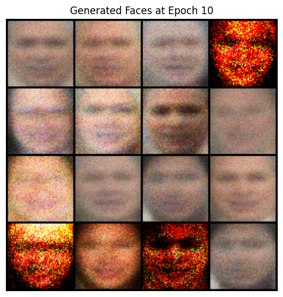
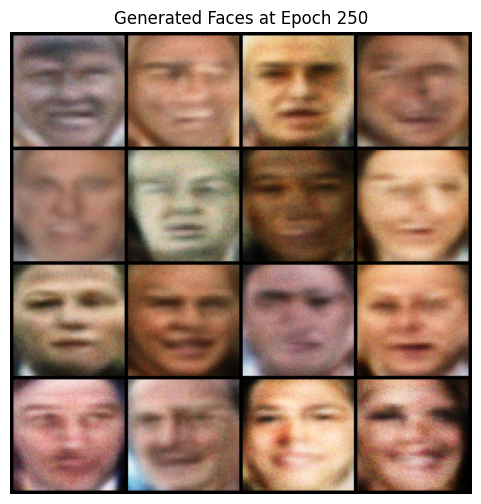
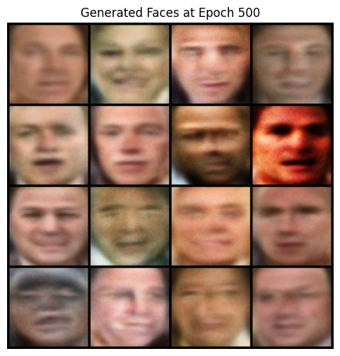

# Faces-GAN

A simple Generative Adversarial Network (GAN) for synthesizing human faces using the LFW (Labeled Faces in the Wild) dataset.

---

## Demo

### Generated Faces Over Time

**Epoch 10**  

**Epoch 250**  

**Epoch 500**  

**GIF of Generated Faces (Epochs 1–500)**  

---

## Features

- Uses the real LFW dataset (color images, resized to 64×64)
- Fully connected generator and discriminator (simple, non-DCGAN)
- Label smoothing for real images
- Dropout and batch normalization for stability
- Saves training images every 10 epochs
- Automatically creates a GIF to visualize progress over time

## Author

Project by **Ethan Posey**  
Original coursework: CSC 351: Machine Learning
